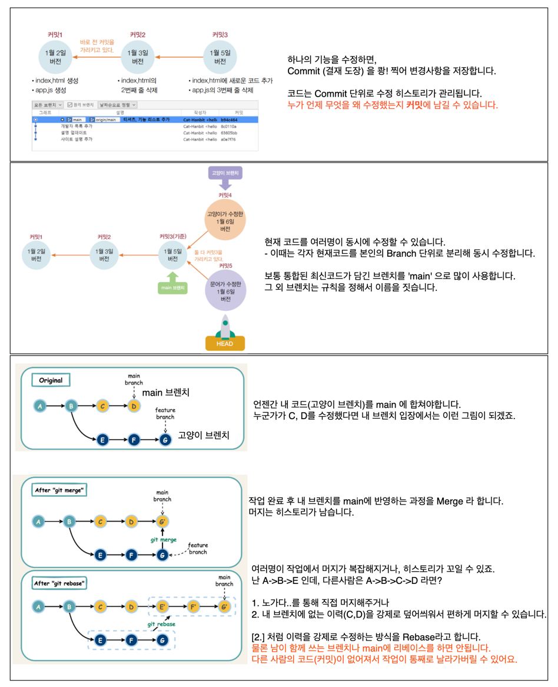
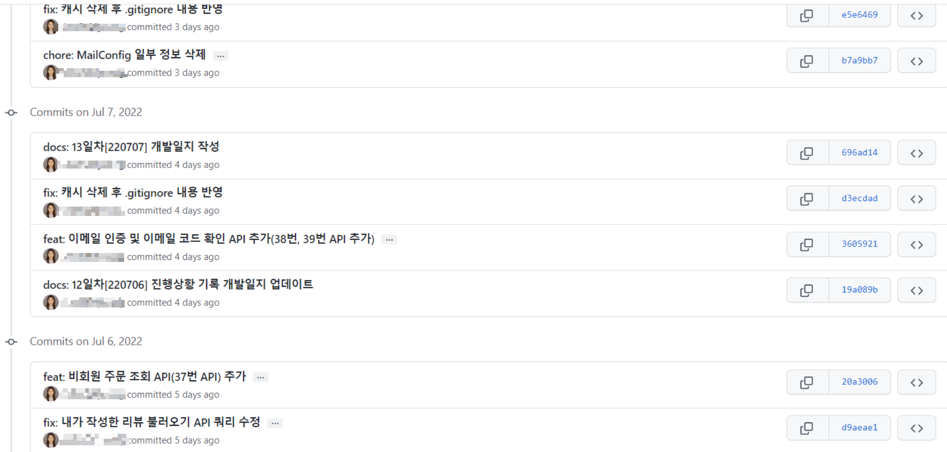
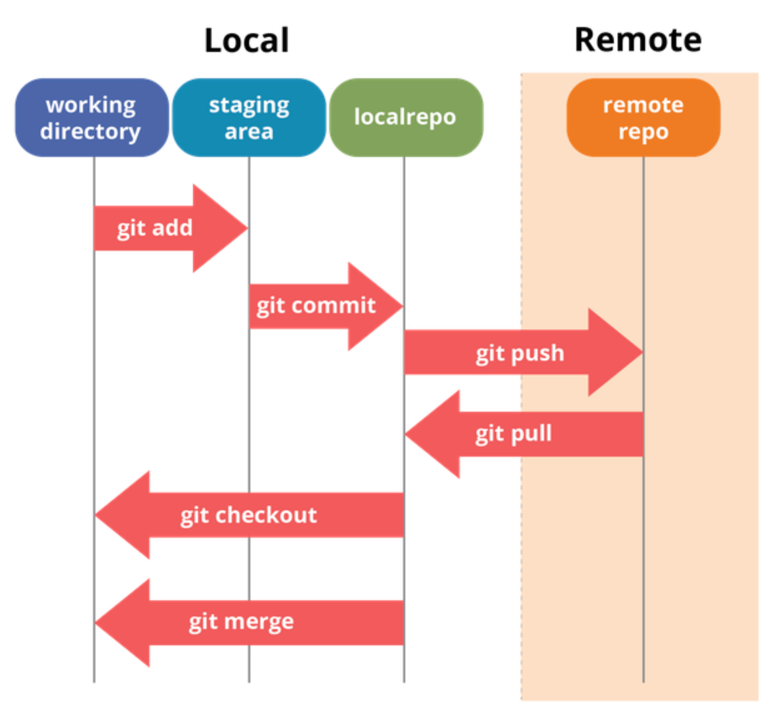
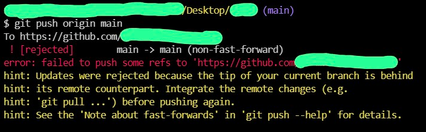
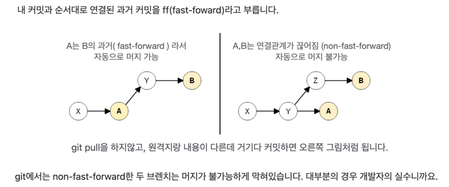

# Git

2000년대 초반, 컴퓨터가 본격적으로 보급되면서 개발자들은 코드를 다음과 같이 관리하곤 했습니다.

* 개발은 혼자 하는 게 아닙니다. 여러 사람이 하나의 프로젝트에서 **같은 코드를 동시에 수정**합니다.
* 모든 코드는 하나의 원본으로 계속해서 통합되어야 하며(CI: Continuous Integration), 누가 언제 어떤 코드를 수정했는지 추적 가능해야 합니다.

예전에는 이런 식으로 파일을 관리했습니다:

```
프로젝트.zip  
프로젝트_초기버전_.zip  
프로젝트_초기버전_철수_수정.zip  
프로젝트_최종_보고용.zip  
프로젝트_최종_보고용_1227_수정.zip  
프로젝트_최종_보고용_0115_최종.zip  
프로젝트_최종_보고용_0221_최종_진짜진짜진짜.zip  
```

이러한 귀찮은 작업을 반복하던 리눅스의 창시자 **Linus Torvalds**는 열받아서 2005년에 무료 CI 도구를 만들었고, 그것이 바로 **Git**입니다.

* [Git 공식 홈페이지](https://git-scm.com/)에서 Git을 설치하고 프로젝트를 추적하기 시작하면, 아래와 같이 버전이 체계적으로 관리됩니다.
* 단, Git은 기본적으로 \*\*로컬(내 컴퓨터)\*\*에서만 작동합니다. 다른 사람과 공유하려면 GitHub 같은 **원격 저장소**를 사용해야 합니다.



---

# Git Command 사용법

## 1. 커밋 메시지 작성 규칙

보통 개발에서는 작업을 "티켓" 단위로 나누며, 커밋 메시지는 다음과 같은 형식을 따릅니다:

```
[타입]: (티켓ID) 무엇을 어떻게
```

예시:

```
feat: PROJECT-001 로그인 기능 추가  
fix: PROJECT-002 로그인 기능 수정  
refactor: PROJECT-005 로그인 기능 리팩토링  
bug: PROJECT-007 간헐적으로 서버가 죽는 버그 수정  
doc: 문서만 수정했음 (티켓 번호 없음)  
build: 서버 배포용 yml 설정 파일 수정  
```



---

## 2. GitHub에서 코드 받아오기 및 설정

### 1) 처음 코드 받기 (clone)

로컬에서 처음으로 프로젝트 코드를 받을 때는 `git clone` 명령어를 사용합니다.

```bash
$ git clone https://github.com/jiwon/example.git
```

### 2) 브랜치 관련 명령어

브랜치를 새로 만들고 전환하려면:

```bash
$ git checkout -b <새 브랜치명>
```

브랜치 목록을 확인하려면:

```bash
$ git branch
$ git branch -a   # 원격 브랜치 포함
```

### 3) 원격 저장소 설정

`git clone`을 하면 기본 원격 저장소가 `origin`으로 자동 등록됩니다.

```bash
$ git remote set-url origin https://github.com/jiwon/example.git
```

현재 등록된 원격 저장소 주소를 확인하려면:
- `fetch(다운로드)` `push(업로드)` 주소는 대부분 동일하게 사용합니다.
```bash
$ git remote -v
origin  https://github.com/jiwon/example.git (fetch)  
origin  https://github.com/jiwon/example.git (push)
```

### 4) 원격 저장소 내용 가져오기

```bash
$ git fetch origin  # 코드만 다운로드, 내 로컬에는 반영 안됨  
$ git pull origin <내 브랜치명>  # fetch + merge 까지 
$ git pull origin main
```

**주의:** 충돌이 발생하면 `git pull --rebase`로 강제로 덮어쓸 수 있지만, 다른 사람의 작업 내용이 사라질 수 있습니다.

---

### 5) 로컬에서 수정 후 커밋하고 push 하기

```bash
$ git add .                         # 수정된 파일을 Git이 추적하게 등록  
$ git commit -m "커밋 메시지"  
$ git push origin main             # 원격 저장소로 반영
```

### 6) 자주 쓰는 축약형 명령어

```bash
$ git push        # = git push origin <현재 브랜치명>  
$ git pull        # = git pull origin <현재 브랜치명>
```

clone 받으면 origin 으로 자동 설정됩니다. 안되면 아래와 같이 upstream을 등록하세요.

```bash
$ git push --set-upstream origin master
```


# 3. 알아두면 도움되는 Git의 구조:

* 아무것도 등록되지 않은 내 로컬 컴퓨터 (=Working Directory)
* `git add .` 을 해서 파일 이력 저장 중 (=Staging Area)
* `git commit` 을 통해 내 로컬 Git에 저장 (=Local Repository)
* `git push` 를 통해 내 로컬 Git을 Github 서버에 업로드 (=Remote Repository)



축약이 되지 않으면 다음 명령어로 설정할 수 있습니다:

```bash
$ git push --set-upstream origin master
```

<br/>

---

# ⚠️ 자주 겪는 Git 에러 모음

### 1) `main` 브랜치 vs `master` 브랜치

브랜치명은 자유롭게 정할 수 있지만, 요즘 Git은 기본 브랜치를 `main`으로 생성합니다.
과거에는 `master`였으나, 인종차별 논란으로 인해 2020년부터 `main`으로 바뀌었습니다.

<br/>

### 2) 방금 클론한 프로젝트인데 push가 안 됩니다

```bash
$ git push
fatal: The current branch <브랜치명> has no upstream branch.
```

이 오류는 원격 저장소가 연결되어 있지 않거나, `upstream` 설정이 없다는 뜻입니다.

해결 방법:

```bash
$ git push --set-upstream origin <브랜치명>
# 또는
$ git push -u origin <브랜치명>
```

참고로 upstream, downstream 이 무엇이냐면

* `upstream`: 원본 저장소 (예: GitHub)
* `downstream`: 작업하는 내 로컬 저장소

다른 예로 GitHub에서 다른 프로젝트를 `fork`(복사) 해온 경우, 원본은 `upstream`, 내 저장소는 `origin`이 됩니다. 상대적인 개념이에요.

---

### 3) git push 했더니 fast-forward 오류 발생



에러 메시지에 나오는 `fast-forward`는 Git에서 실수 방지를 위해 푸시를 막는 설정입니다.



**해결 방법:**

* 깔끔한 해결책:
  **내 커밋을 롤백하고**, 원격 저장소를 pull로 받아 병합한 뒤 다시 commit + push

* 대충 강제로 덮어쓰는 방법:

```bash
$ git pull origin main --allow-unrelated-histories  # 수동 병합 허용  
$ git push origin main --force                      # 내 로컬 상태를 강제로 덮어쓰기  
# 또는
$ git push -f
```
